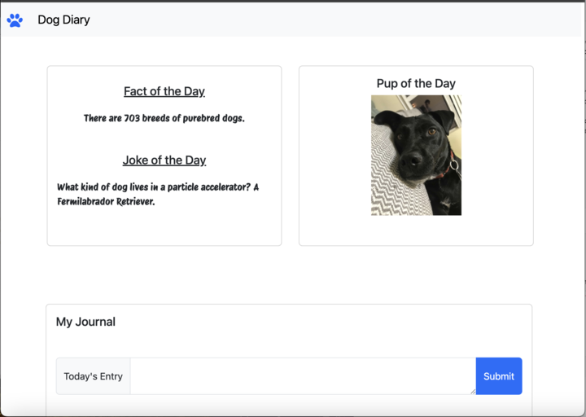

# Dog Journal

# User Story

As a dog fanatic, I want a central location where I can learn and save interesting facts about dogs so that I can become wiser in my favorite subject.

## Acceptance Criteria

GIVEN that I want to save the information that I learn about dogs.

WHEN I refresh my page, THEN I'm presented with a new photo of a dog, a new fun fact, and a dog joke

WHEN I write down interesting information in the notes section

THEN those facts appear in a "saved facts" pane and are automatically stored w/in my browser

## Homepage

## Project Requirements

1. Must Use at least two server-side APIs
2. Must use a CSS framework: Bootstrap (or other)
3. Must use client-side storage to store persistent data
4. Must have a polished UI. responsive to different screen sizes
5. Must meed good quality coding standards (indention, scoping, naming, comment, etc.)
6. Must NOT use alerts, confirms, or prompts (look into modals instead)
7. Must be deployed to GitHub pages
8. Must be interactive(i.e.: accept and respond to user input)

## LINKS

[Github](https://github.com/xjessycaz12X/dog-journal)

[DeployedApp](https://xjessycaz12x.github.io/dog-journal/)
